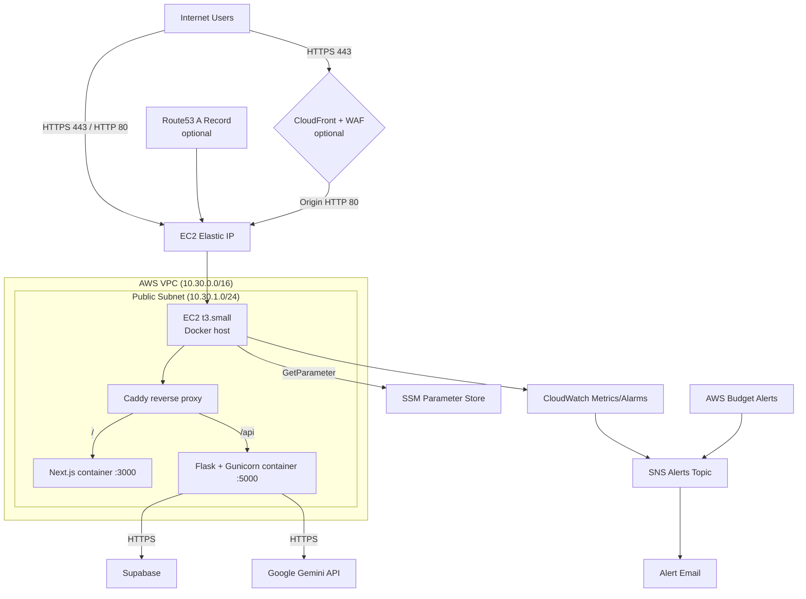

# AWS Minimal Production Stack (EC2 + TLS + Optional Edge WAF)

This stack is designed to keep costs low while making the app publicly available with baseline security.

## What This Stack Provisions

- VPC with one public subnet
- Internet Gateway and public route table
- One EC2 instance (Amazon Linux 2023) with Elastic IP
- Security group with locked-down inbound rules
- IAM role/profile for EC2 with:
  - Session Manager access
  - Read access to two SSM SecureString parameters (backend/frontend env)
- CloudWatch alarms (CPU + status checks)
- SNS alerts topic + email subscription for alarms and budget notifications
- AWS Budget alerts (forecasted + actual)
- Optional CloudFront + AWS WAF rate rule for edge throttling
- Optional Route53 records

## Runtime Bootstrap on EC2

`user_data` does:

1. Installs Docker, Git, AWS CLI.
2. Clones your repo and checks out selected ref.
3. Pulls env content from SSM Parameter Store into:
   - `backend/.env`
   - `frontend/.env.production`
4. Appends `NEXT_PUBLIC_API_BASE_URL` to `frontend/.env.production`.
5. Writes a Caddy reverse-proxy config.
6. Runs `docker compose --build` using `deploy/docker-compose.prod.yml`.

## Architecture Diagram



## Network / Security Behavior

- `enable_edge_protection = false`:
  - Security Group opens `80/443` to public internet.
  - Caddy handles TLS directly on EC2 for your `domain_name`.
  - If `domain_name` + `route53_zone_id` are set, Terraform creates an A record pointing to the EC2 Elastic IP.

- `enable_edge_protection = true`:
  - Public traffic enters CloudFront.
  - WAF rate-based rule blocks abusive IPs at edge.
  - EC2 Security Group allows `80` only from CloudFront origin-facing prefix list.
  - CloudFront terminates TLS (ACM cert in `us-east-1`).

## Inputs You Must Provide

- `app_repo_url`
- `backend_env_parameter`
- `frontend_env_parameter`
- `budget_alert_email`

Recommended for production:

- `domain_name`
- `route53_zone_id`
- `enable_edge_protection = true`

## SSM Parameters Expected

Create these as `SecureString` values:

- `backend_env_parameter`: full multi-line content of `backend/.env`
- `frontend_env_parameter`: full content for frontend runtime/build env file

## Example Commands

```bash
cd infra/aws-minimal
cp backend.hcl.example backend.hcl
terraform init -backend-config=backend.hcl
terraform plan -var-file=terraform.tfvars
terraform apply -var-file=terraform.tfvars
```

## Notes / Tradeoffs

- This is cost-minimal, not highly available (single instance).
- For multi-instance scale later, move to ALB + ECS and shared Redis for limiter state.
- WAF/CloudFront adds cost but materially improves abuse resistance.
- CloudWatch alarm and SNS email notifications require email confirmation for the subscription.
